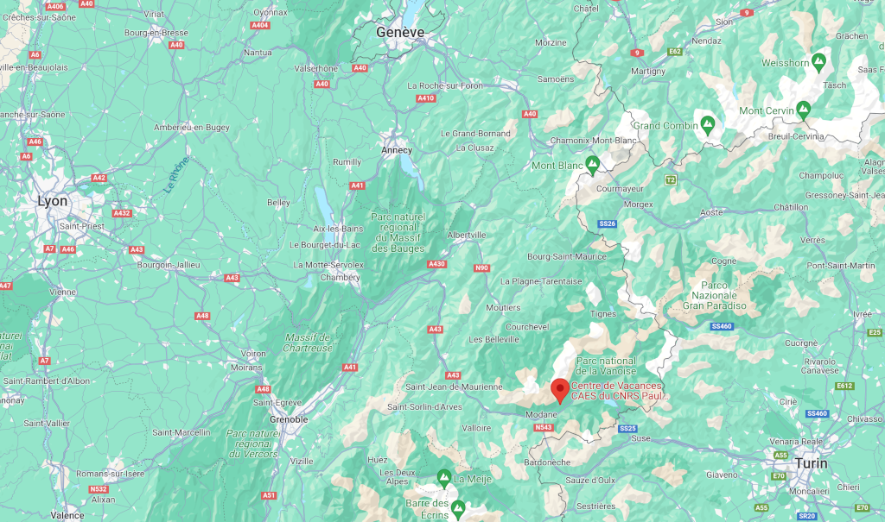

## Venue

The school will take place at [Centre Paul Langevin](https://www.caes.cnrs.fr/sejours/centre-paul-langevin-3-2/) in Aussois, region Auvergne-Rhône-Alpes, France.
Aussois is a small Savoyard village facing south at the gateway of the Vanoise National Park at an altitude of 1500 meters.
It is located in the French alps at 200 kilometers of Lyon and 150 kilometers of Grenoble.
Around Lyon, all the necessary infrastructures can be found, including an international airport offering regular and affordable flights to Europe and North America.

## Come with us

Our preferred way: reach the beautiful city of Lyon, and let us take care of the bus transfer to the Centre Paul Langevin.
The bus shuttle will depart from the Lyon « Part-Dieu » Train Station to the school location with a stop at the Lyon International Airport.

## Come by your own

Unfortunately, since the collapse in the Valée de la Maurienne, coming by train is difficult. We also want to warn you about the venue from Turin by car which goes through the Tunnel du Fréjus. 
Indeed, the fee from passing through the tunnel are very expensive (around 45euros).

Therefore, we encourage every participant to meet us at Lyon to take the shuttle with us.

## Map

